# SSM-CRUD

前言

```
create 创建
retrieve 查询
update 修改
delete 删除

参考视频：雷神SSM整合。

害~基本全都在写前端的东西！bootstap、ajax、jQuery！！！
```


## 一、功能点与技术点

### 1、功能点

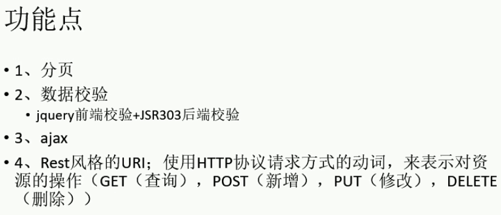

### 2、技术点

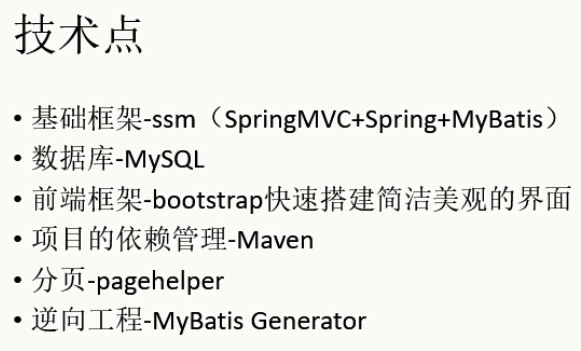


## 二、环境搭建

### 1、创建Maven工程

设置maven：阿里镜像、本地仓库、JDK版本。

pom.xml

```xml
<!-- 打包为war，因为是web项目。 -->
<packaging>war</packaging>
```

雷神用eclipse，这里使用idea

```
选择maven的web骨架创建，（纯maven项目也行，但记得手动添加web模块）
要手动添加java、test构成maven约定目录结构，
记得标记为各自类型的包！（源码、资源、测试等类型的包）

使用maven骨架生成的web.xml会有些问题！！自己新建一个web工程，将其web.xml复制过来即可。
```

目录结构

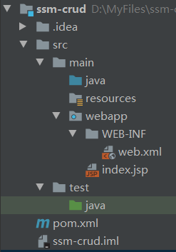


### 2、引入依赖jar包

```xml
spring
springmvc
mybatis
数据库连接池、驱动包
其它（junit、jstl、servlet...）
```

pom.xml

```xml
<!-- Spring、SpringMVC -->
<dependency>
    <groupId>org.springframework</groupId>
    <artifactId>spring-webmvc</artifactId>
    <version>4.3.7.RELEASE</version>
</dependency>

<!-- Spring-Jdbc -->
<dependency>
    <groupId>org.springframework</groupId>
    <artifactId>spring-jdbc</artifactId>
    <version>4.3.7.RELEASE</version>
</dependency>

<!-- Spring面向切面编程 -->
<dependency>
    <groupId>org.springframework</groupId>
    <artifactId>spring-aspects</artifactId>
    <version>4.3.7.RELEASE</version>
</dependency>

<!-- Mybatis -->
<dependency>
    <groupId>org.mybatis</groupId>
    <artifactId>mybatis</artifactId>
    <version>3.4.2</version>
</dependency>

<!-- MyBatis整合Spring的适配包 -->
<dependency>
    <groupId>org.mybatis</groupId>
    <artifactId>mybatis-spring</artifactId>
    <version>1.3.1</version>
</dependency>

<!-- c3p0数据源 -->
<dependency>
    <groupId>c3p0</groupId>
    <artifactId>c3p0</artifactId>
    <version>0.9.1</version>
</dependency>

<!-- 数据库驱动包8.0 -->
<dependency>
    <groupId>mysql</groupId>
    <artifactId>mysql-connector-java</artifactId>
    <version>8.0.20</version>
</dependency>

<!-- jstl -->
<dependency>
    <groupId>jstl</groupId>
    <artifactId>jstl</artifactId>
    <version>1.2</version>
</dependency>

<!-- servlet -->
<dependency>
    <groupId>javax.servlet</groupId>
    <artifactId>javax.servlet-api</artifactId>
    <version>3.0.1</version>
    <scope>provided</scope>
</dependency>

<!-- junit -->
<dependency>
    <groupId>junit</groupId>
    <artifactId>junit</artifactId>
    <version>4.12</version>
<!-- 若不在maven约定的test下使用，则不要使用scope-test作用域！不写，默认是scope-compile作用域 -->
    <scope>test</scope>
</dependency>
```


### 3、引入前端框架BootStrap、jQuery

从[官网下载](https://www.bootcss.com/)bootstrap包。

```jsp
<%-- 引入jQuery --%>
<script src="static/js/jquery.min.js"></script>

<%-- 引入样式 --%>
<link href="static/bootstrap-3.3.7-dist/css/bootstrap.min.css" rel="stylesheet">
<script src="static/bootstrap-3.3.7-dist/js/bootstrap.min.js"/>
```


### 4、SSM整合的关键配置

#### 4.1、web.xml

```xml
<?xml version="1.0" encoding="UTF-8"?>
<web-app xmlns="http://xmlns.jcp.org/xml/ns/javaee"
         xmlns:xsi="http://www.w3.org/2001/XMLSchema-instance"
         xsi:schemaLocation="http://xmlns.jcp.org/xml/ns/javaee http://xmlns.jcp.org/xml/ns/javaee/web-app_4_0.xsd"
         version="4.0">

  <!-- 1、启动Spring容器 -->
  <context-param>
    <param-name>contextConfigLocation</param-name>
    <param-value>classpath:applicationContext.xml</param-value>
  </context-param>
  <listener>
    <listener-class>org.springframework.web.context.ContextLoaderListener</listener-class>
  </listener>

  <!-- 2、SpringMVC的前端控制器，拦截所有请求 -->
  <servlet>
    <servlet-name>dispatcherServlet</servlet-name>
    <servlet-class>org.springframework.web.servlet.DispatcherServlet</servlet-class>
    <!-- 不配置路径，则需要一个名为“dispatcherServlet-servlet.xml”的文件在WEB-INF/目录下 -->
<!--    <init-param>
      <param-name>contextConfigLocation</param-name>
      <param-value>classpath:/xxxx.xml</param-value>
    </init-param>-->
    <load-on-startup>1</load-on-startup>
  </servlet>
  <servlet-mapping>
    <servlet-name>dispatcherServlet</servlet-name>
    <url-pattern>/</url-pattern>
  </servlet-mapping>

  <!-- 3、字符编码过滤器（放在所有过滤器之前） -->
  <filter>
    <filter-name>characterEncodingFilter</filter-name>
    <filter-class>org.springframework.web.filter.CharacterEncodingFilter</filter-class>
    <init-param>
      <param-name>encoding</param-name>
      <param-value>UTF-8</param-value>
    </init-param>
    <init-param>
      <param-name>forceRequestEncoding</param-name>
      <param-value>true</param-value>
    </init-param>
    <init-param>
      <param-name>forceResponseEncoding</param-name>
      <param-value>true</param-value>
    </init-param>
  </filter>
  <filter-mapping>
    <filter-name>characterEncodingFilter</filter-name>
    <url-pattern>/*</url-pattern>
  </filter-mapping>

  <!-- 使用Rest风格的URI -->
  <filter>
    <filter-name>hiddenHttpMethodFilter</filter-name>
    <filter-class>org.springframework.web.filter.HiddenHttpMethodFilter</filter-class>
  </filter>
  <filter-mapping>
    <filter-name>hiddenHttpMethodFilter</filter-name>
    <url-pattern>/*</url-pattern>
  </filter-mapping>

</web-app>
```

#### 4.2、springmvc

```xml
<?xml version="1.0" encoding="UTF-8"?>
<beans xmlns="http://www.springframework.org/schema/beans"
       xmlns:xsi="http://www.w3.org/2001/XMLSchema-instance"
       xmlns:context="http://www.springframework.org/schema/context"
       xmlns:mvc="http://www.springframework.org/schema/mvc"
       xsi:schemaLocation="http://www.springframework.org/schema/beans http://www.springframework.org/schema/beans/spring-beans.xsd http://www.springframework.org/schema/context http://www.springframework.org/schema/context/spring-context.xsd http://www.springframework.org/schema/mvc http://www.springframework.org/schema/mvc/spring-mvc.xsd">

    <!-- SpringMVC的配置文件，包括网站跳转逻辑的控制 -->
    <context:component-scan base-package="com.myself" use-default-filters="false">
        <!-- 扫描控制器 -->
        <context:include-filter type="annotation" expression="org.springframework.stereotype.Controller"/>
    </context:component-scan>

    <!-- 视图解析器，方便页面返回 -->
    <bean class="org.springframework.web.servlet.view.InternalResourceViewResolver">
        <property name="prefix" value="/WEB-INF/views/"/>
        <property name="suffix" value=".jsp"/>
    </bean>

    <!-- 两个标准配置 -->
    <!-- 将springmvc不能处理的请求交给Tomcat -->
    <mvc:default-servlet-handler/>
    <!-- 能支持springmvc更高级的功能，例如：JSR303校验、快捷的ajax...映射动态请求 -->
    <mvc:annotation-driven/>

</beans>
```

#### 4.3、spring

```xml
<?xml version="1.0" encoding="UTF-8"?>
<beans xmlns="http://www.springframework.org/schema/beans"
       xmlns:xsi="http://www.w3.org/2001/XMLSchema-instance"
       xmlns:context="http://www.springframework.org/schema/context"
       xmlns:aop="http://www.springframework.org/schema/aop" xmlns:tx="http://www.springframework.org/schema/tx"
       xsi:schemaLocation="http://www.springframework.org/schema/beans http://www.springframework.org/schema/beans/spring-beans.xsd http://www.springframework.org/schema/context http://www.springframework.org/schema/context/spring-context.xsd http://www.springframework.org/schema/aop http://www.springframework.org/schema/aop/spring-aop.xsd http://www.springframework.org/schema/cache http://www.springframework.org/schema/cache/spring-cache.xsd http://www.springframework.org/schema/tx http://www.springframework.org/schema/tx/spring-tx.xsd">

    <!-- Spring的配置文件，主要配置与业务逻辑有关的 -->
    <!-- Spring的核心配置：数据源、与mybatis的整合、事务控制 -->
    <!-- 约束的名称空间不要导错！否则错误满天飞！ -->

    <!-- ==================================================================================== -->

    <context:component-scan base-package="com.myself">
        <!-- 除了控制器外都扫描 -->
        <context:exclude-filter type="annotation" expression="org.springframework.stereotype.Controller"/>
    </context:component-scan>

    <!-- ==================================================================================== -->

    <!-- 导入外部配置文件 -->
    <context:property-placeholder location="classpath:dbconfig.properties"/>

    <!-- 数据源 -->
    <bean id="pooledDataSource" class="com.mchange.v2.c3p0.ComboPooledDataSource">
        <property name="driverClass" value="${jdbc.driverClass}"/>
        <property name="user" value="${jdbc.username}"/>
        <property name="password" value="${jdbc.password}"/>
        <property name="jdbcUrl" value="${jdbc.jdbcUrl}"/>
    </bean>

    <!-- ==================================================================================== -->

    <!-- 配置整合MyBatis -->
    <bean id="sqlSessionFactory" class="org.mybatis.spring.SqlSessionFactoryBean">
        <!-- 指定MyBatis全局配置文件的位置 -->
        <property name="configLocation" value="classpath:mybatis-config.xml"/>
        <property name="dataSource" ref="pooledDataSource"/>  <!-- 这是ref，引用其它bean -->
        <!-- 指定mybatis的mapper文件的位置 -->
        <property name="mapperLocations" value="classpath:mapper/*.xml"/>
    </bean>

    <!-- 配置扫描器，将mybatis接口的实现加入到ioc容器中 -->
    <bean class="org.mybatis.spring.mapper.MapperScannerConfigurer">
        <property name="basePackage" value="com.myself.crud.dao"/>
    </bean>

    <!-- ==================================================================================== -->

    <!-- 事务控制的配置 -->
    <bean id="transactionManager" class="org.springframework.jdbc.datasource.DataSourceTransactionManager">
        <property name="dataSource" ref="pooledDataSource"/>  <!-- 控制住数据源 -->
    </bean>

    <!-- 开启基于注解的事务，或者使用xml配置形式的事务（一般重要的使用配置形式） -->
    <aop:config>
        <!-- 切入点表达式 -->
        <aop:pointcut id="txPoint" expression="execution(* com.myself.crud.service..*(..))"/>
        <!-- 配置事务增强 -->
        <aop:advisor advice-ref="txAdvice" pointcut-ref="txPoint"/>
    </aop:config>

    <!-- 上面是：哪些方法需要切入；下面是：切入后，具体细节如何实现 -->

    <!-- 配置事务增强，事务如何切入 -->
    <tx:advice id="txAdvice" transaction-manager="transactionManager">
        <tx:attributes>
            <!-- 所有方法都是事务方法 -->
            <tx:method name="*"/>
            <!-- 以get开始的所有方法，我们默认都是查询方法，为了调优，可以设置为只读 -->
            <tx:method name="get*" read-only="true"/>
        </tx:attributes>
    </tx:advice>

    <!-- ==================================================================================== -->

</beans>
```

#### 4.4、mybatis

mybatis全局配置文件中的所有内容，一般都可以在Spring配置中的整合那里使用property来配置，所以这个全局配置文件可有可无，但一般也会给它保留出来！让其也配置一些东西，否则都在整合那里的话就像一个臃肿的胖子！

参考官方来编写（有中文版的）

```xml
<?xml version="1.0" encoding="UTF-8"?>
<!DOCTYPE configuration
        PUBLIC "-//mybatis.org//DTD Config 3.0//EN"
        "http://mybatis.org/dtd/mybatis-3-config.dtd">
<configuration>

    <settings>
        <setting name="mapUnderscoreToCamelCase" value="true"/>
    </settings>
    <typeAliases>
        <package name="com.myself.crud.bean"/>
    </typeAliases>
    
</configuration>
```


### 5、生成dao、service等项目结构

#### 5.1、数据库表

tbl_emp

```sql
CREATE TABLE `tbl_emp` (
  `emp_id` int NOT NULL AUTO_INCREMENT,
  `emp_name` varchar(255) CHARACTER SET utf8 COLLATE utf8_general_ci NOT NULL,
  `gender` char(1) DEFAULT NULL,
  `email` varchar(255) CHARACTER SET utf8 COLLATE utf8_general_ci DEFAULT NULL,
  `d_id` int DEFAULT NULL,
  PRIMARY KEY (`emp_id`)
) ENGINE=InnoDB DEFAULT CHARSET=utf8;
```

tbl_dept

```sql
CREATE TABLE `tbl_dept` (
  `dept_id` int NOT NULL AUTO_INCREMENT,
  `dept_name` varchar(255) NOT NULL,
  PRIMARY KEY (`dept_id`)
) ENGINE=InnoDB DEFAULT CHARSET=utf8;
```


#### 5.2、MyBatis逆向工程

生成bean、mapper、dao接口等，[参考网址](http://mybatis.org/generator/configreference/xmlconfig.html)

pom.xml

```XML
<!-- https://mvnrepository.com/artifact/org.mybatis.generator/mybatis-generator-core -->
<dependency>
    <groupId>org.mybatis.generator</groupId>
    <artifactId>mybatis-generator-core</artifactId>
    <version>1.3.5</version>
</dependency>
```

mbg.xml

```xml
<?xml version="1.0" encoding="UTF-8"?>
<!DOCTYPE generatorConfiguration
        PUBLIC "-//mybatis.org//DTD MyBatis Generator Configuration 1.0//EN"
        "http://mybatis.org/dtd/mybatis-generator-config_1_0.dtd">

<generatorConfiguration>

    <context id="DB2Tables" targetRuntime="MyBatis3">

        <!-- 不生成注释 -->
        <commentGenerator>
            <property name="suppressAllComments" value="true" />
        </commentGenerator>

        <!-- 配置数据库连接 -->
        <jdbcConnection driverClass="com.mysql.cj.jdbc.Driver"
                        connectionURL="jdbc:mysql://localhost:3306/ssm_crud?useUnicode=true&amp;characterEncoding=utf-8&amp;serverTimezone=GMT%2B8&amp;useSSL=false"
                        userId="root"
                        password="123456">
        </jdbcConnection>

        <javaTypeResolver >
            <property name="forceBigDecimals" value="false" />
        </javaTypeResolver>

        <!-- 指定Javabean生成的位置 -->
        <javaModelGenerator targetPackage="com.myself.crud.bean" targetProject=".\src\main\java">
            <property name="enableSubPackages" value="true" />
            <property name="trimStrings" value="true" />
        </javaModelGenerator>

        <!-- 指定SQL映射文件生成的位置 -->
        <sqlMapGenerator targetPackage="mapper"  targetProject=".\src\main\resources">
            <property name="enableSubPackages" value="true" />
        </sqlMapGenerator>

        <!-- 指定dao接口生成的位置，mapper接口 -->
        <javaClientGenerator type="XMLMAPPER" targetPackage="com.myself.crud.dao"  targetProject=".\src\main\java">
            <property name="enableSubPackages" value="true" />
        </javaClientGenerator>

        <!-- 指定每个表生成的策略 -->
        <table tableName="tbl_emp" domainObjectName="Employee" ></table>
        <table tableName="tbl_dept" domainObjectName="Department" ></table>

    </context>
</generatorConfiguration>
```

生成类

```java
import org.mybatis.generator.api.MyBatisGenerator;
import org.mybatis.generator.config.Configuration;
import org.mybatis.generator.config.xml.ConfigurationParser;
import org.mybatis.generator.internal.DefaultShellCallback;

import java.io.File;
import java.util.ArrayList;
import java.util.List;

public class MBGTest {

    public static void main(String[] args) throws Exception {
        List<String> warnings = new ArrayList<String>();
        boolean overwrite = true;
        File configFile = new File("mbg.xml");
        ConfigurationParser cp = new ConfigurationParser(warnings);
        Configuration config = cp.parseConfiguration(configFile);
        DefaultShellCallback callback = new DefaultShellCallback(overwrite);
        MyBatisGenerator myBatisGenerator = new MyBatisGenerator(config, callback, warnings);
        myBatisGenerator.generate(null);

        System.out.println("代码已生成...");
    }
}
```


#### 5.3、修改mapper文件

主要是多表联合查询！

Employee.java

```java
// 查询员工的同时，部门也查询出来
private Department department;
// 别忘了添加getter、setter等一个标准的Javabean结构
```

EmployeeMapper.java

```java
// 新添加两个查询，带上部门信息
List<Employee> selectByExampleWithDept(EmployeeExample example);
Employee selectByPrimaryKeyWithDept(Integer empId);
```

EmployeeMapper.xml

```xml
  <!-- 自定义封装规则 -->
  <resultMap id="withDeptResultMap" type="com.myself.crud.bean.Employee">
    <id column="emp_id" jdbcType="INTEGER" property="empId" />
    <result column="emp_name" jdbcType="VARCHAR" property="empName" />
    <result column="gender" jdbcType="CHAR" property="gender" />
    <result column="email" jdbcType="VARCHAR" property="email" />
    <result column="d_id" jdbcType="INTEGER" property="dId" />
    <!-- 指定【联合查询出的部门字段的】封装规则 -->
    <association property="department" javaType="com.myself.crud.bean.Department">
      <id column="dept_id" property="deptId"/>
      <result column="dept_name" property="deptName"/>
    </association>
  </resultMap>

  <!-- 公共语句块 -->
  <sql id="WithDept_Column_List">
    e.emp_id, e.emp_name, e.gender, e.email, e.d_id, d.dept_id, d.dept_name
  </sql>

  <!-- 查询员工时，带部门信息的 -->

  <!-- List<Employee> selectByExampleWithDept(EmployeeExample example); -->
  <select id="selectByExampleWithDept" resultMap="withDeptResultMap">
    select
    <if test="distinct">
      distinct
    </if>
    <include refid="WithDept_Column_List" />
    from tbl_emp e
    left join tbl_dept d on e.d_id=d.dept_id
    <if test="_parameter != null">
      <include refid="Example_Where_Clause" />
    </if>
    <if test="orderByClause != null">
      order by ${orderByClause}
    </if>
  </select>

  <!-- Employee selectByPrimaryKeyWithDept(Integer empId); -->
  <select id="selectByPrimaryKeyWithDept" resultMap="withDeptResultMap">
    select
    <include refid="WithDept_Column_List" />
    from tbl_emp e
    left join tbl_dept d on e.d_id=d.dept_id
    where emp_id = #{empId,jdbcType=INTEGER}
  </select>
```


### 6、搭建Spring单元测试环境、测试mapper

导入Spring单元测试模块

```xml
<!-- Spring的单元测试模块 -->
<dependency>
    <groupId>org.springframework</groupId>
    <artifactId>spring-test</artifactId>
    <version>4.3.7.RELEASE</version>
</dependency>
```

Spring单元测试+mapper测试

```java
/**
 * @author lzq
 * @create 2020-07-28 11:46
 *
 * 测试Dao接口里的方法能否达到我们的预期！
 *
 * 推荐Spring项目使用Spring的单元测试，因为可以自动注入我们需要的组件。
 *  1、导入Spring单元测试模块：<artifactId>spring-test</artifactId>
 *  2、@ContextConfiguration指定Spring配置文件位置；
 *  3、直接autowired要使用的组件即可！
 */
@RunWith(SpringJUnit4ClassRunner.class)  // 使用Spring的测试驱动，而不再是默认的junit
@ContextConfiguration(locations = {"classpath:applicationContext.xml"})  // 注意path的'p'是小写
public class MapperTest {

    // 直接autowired要使用的组件
    @Autowired
    DepartmentMapper departmentMapper;
    @Autowired
    EmployeeMapper employeeMapper;
    @Autowired
    SqlSession sqlSession;
    // 在配置那里定义成了可以批量操作的sqlSession，通过这个sqlSession获取的mapper可以批量操作；
    // 若是默认的获取mapper，则不是批量操作！

    /**
     * 测试DepartmentMapper接口
     */
    @Test
    public void testCRUD(){
        // 一、不使用Spring单元测试时，需要手动创建ioc，并获取mapper
        /*
        // 1、初始化Spring的IOC容器
        ApplicationContext applicationContext = new ClassPathXmlApplicationContext("applicationContext.xml");
        // 2、从容器中获取Dao接口的SQL映射器mapper
        DepartmentMapper mapper = applicationContext.getBean(DepartmentMapper.class);
        */

        // 二、使用Spring单元测试后，可直接使用mapper（注意先autowired）
        //System.out.println(departmentMapper);

        // 插入几个部门
/*        departmentMapper.insertSelective(new Department(null,"开发部"));
        departmentMapper.insertSelective(new Department(null,"测试部"));
        System.out.println("插入成功...");*/

        // 插入员工数据
        // gender类型：数据库字段是char，对象属性是String（底层会自动转换的，所以不需要考虑类型问题！）
/*        employeeMapper.insert(new Employee(null,"Jerry","M","jerry@myself.com",1));
        System.out.println("插入成功...");*/

        // 批量插入员工数据
        /*
            拓展：因为sqlSession在项目中可能会多次使用，所以可以直接在ioc容器中注册，然后直接拿到；
                并且注册时还可以设置为批量操作的sqlSession，
                默认的sqlSession拿到的mapper不会执行批量操作，需要设置。
         */

        // 直接一个for循环插入，则不是批量插入，而是一个个的插入，效率会很低；
/*        for (int i = 0; i < 1000; i++) {
            employeeMapper.insertSelective(new Employee(null,"Jerry","M","jerry@myself.com",1));
        }*/

        // 通过我们配置了批量操作的sqlSession获取的mapper使用for循环插入，才是批量操作！（sqlSession注册后，还需要autowired才能直接使用）
        EmployeeMapper mapper = sqlSession.getMapper(EmployeeMapper.class);
        for (int i = 0; i < 1000; i++) {
            // 随机生成字符作为员工姓名插入
            String uid = UUID.randomUUID().toString().substring(0, 5) + i;
            mapper.insertSelective(new Employee(null,uid,"M",uid+"@myself.com",1));
        }
        System.out.println("批量插入成功...");
        // 另外：不知是电脑性能问题还是没有配置批量成功的原因，用了2分钟左右才将1000条记录插入成功！
    }
}
```

applicationContext.xml

```xml
<!-- 配置整合MyBatis -->
<bean id="sqlSessionFactory" class="org.mybatis.spring.SqlSessionFactoryBean">
    ...
</bean>

<!-- 配置一个可以执行批量操作的sqlSession -->
<bean id="sqlSession" class="org.mybatis.spring.SqlSessionTemplate">
    <constructor-arg name="sqlSessionFactory" ref="sqlSessionFactory"/>  <!-- 引用上面那个整合的factory -->
    <constructor-arg name="executorType" value="BATCH"/>  <!-- 执行器：批量（默认不是批量的，所以需要指定） -->
</bean>
```


## 三、查询

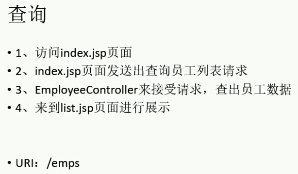

### 1、分页后台代码完成

index.jsp

```jsp
<%@ page contentType="text/html;charset=UTF-8" language="java" %>
<jsp:forward page="/emps"></jsp:forward>
```

list.jsp

```jsp
<%@ page contentType="text/html;charset=UTF-8" language="java" %>
<html>
<head>
    <title>员工列表</title>
</head>
<body>

</body>
</html>
```

controller

```java
/**
 * @author lzq
 * @create 2020-07-28 13:51
 *
 * 处理员工CRUD请求
 */
@Controller
public class EmployeeController {

    @Autowired
    EmployeeService employeeService;

    /**
     * 查询员工信息（分页查询）
     * @return
     */
    @RequestMapping("/emps")
    public String getEmps(@RequestParam(value = "pn",defaultValue = "1") Integer pn, Model model){  // pn：PageNumber
        // 默认不是分页查询，此时需要引入pageHelper分页插件
        // 在查询之前调用PageHelper的方法，其后面紧跟的查询就会被解析成分页查询了
        PageHelper.startPage(pn,5);  // 参数：页码、每页大小
        List<Employee> emps = employeeService.getAll();
        // 使用pageInfo包装查询结果，然后将它交给model传到页面即可
        // PageInfo不仅封装了查询结数据，还封装了分页的详细信息
        PageInfo page = new PageInfo(emps,5);  // 参数5：连续显示的页数
        model.addAttribute("pageInfo",page);
        return "list";
    }
}
```

service

```java
/**
 * @author lzq
 * @create 2020-07-28 13:55
 */
@Service
public class EmployeeService {

    @Autowired
    EmployeeMapper employeeMapper;

    /**
     * 查询所有员工
     * @return
     */
    public List<Employee> getAll() {
        return employeeMapper.selectByExampleWithDept(null);
    }
}
```

pom.xml

```xml
<!-- 引入分页插件 -->
<dependency>
    <groupId>com.github.pagehelper</groupId>
    <artifactId>pagehelper</artifactId>
    <version>5.0.0</version>
</dependency>
```

mybatis-config.xml（或者在spring整合那里配置）

```xml
<!-- 注册分页插件 -->
<plugins>
    <plugin interceptor="com.github.pagehelper.PageInterceptor"></plugin>
</plugins>
```


### 2、使用Spring单元测试，验证分页查询请求

使用spring测试模块提供的功能来测试请求！后面会说到前端页面发送请求测试的！

pom.xml

```xml
<!-- servlet需要3.0以上的支持，将原来的2.5升为3.0以上 -->
<dependency>
    <groupId>javax.servlet</groupId>
    <artifactId>javax.servlet-api</artifactId>
    <version>3.0.1</version>
    <scope>provided</scope>
</dependency>
```

测试

```java
/**
 * @author lzq
 * @create 2020-07-28 14:32
 *
 * 使用Spring测试模块提供的测试请求功能，验证CRUD请求的正确性！
 * （试试测试模块的一个测试功能好不好用而已！暂时不使用页面来测试，）
 *
 * 另外：Spring4测试，需要servlet 3.0支持
 *      <dependency>
 *       <groupId>javax.servlet</groupId>
 *       <artifactId>javax.servlet-api</artifactId>
 *       <version>3.0.1</version>
 *       <scope>provided</scope>
 *     </dependency>
 */
@RunWith(SpringJUnit4ClassRunner.class)
@ContextConfiguration(locations = {"classpath:applicationContext.xml","file:src/main/webapp/WEB-INF/dispatcherServlet-servlet.xml"})  // 红色波浪线错误提示，忽略它不影响结果
@WebAppConfiguration
public class MvcTest {

    // 传入spring的ioc
    @Autowired
    WebApplicationContext context;
    // 虚拟mvc请求，获取到处理结果
    MockMvc mockMvc;

    @Before
    public void initMokcMvc(){
        mockMvc = MockMvcBuilders.webAppContextSetup(context).build();
    }

    @Test
    public void testPage() throws Exception {
        // 模拟请求拿到返回值
        MvcResult result = mockMvc.perform(MockMvcRequestBuilders.get("/emps").param("pn","1")).andReturn();

        // 请求成功后，请求域中会有pageInfo，我们可以取出进行验证
        MockHttpServletRequest request = result.getRequest();
        PageInfo p = (PageInfo) request.getAttribute("pageInfo");
        System.out.println("当前页面：" + p.getPageNum());
        System.out.println("总页码：" + p.getPages());
        System.out.println("总记录数：" + p.getTotal());
        System.out.println("在页面需要连续显示的页面：");
        int[] nums = p.getNavigatepageNums();
        for (int i : nums) {
            System.out.println(" " + i);
        }
        // 获取员工数据
        List<Employee> list = p.getList();
        for (Employee employee : list) {
            System.out.println("id：" + employee.getEmpId() + " ， name：" + employee.getEmpName());
        }
    }
}
```


### 3、搭建Bootstrap分页页面

```jsp
<%--
    关于web路径：

    1、不以【/】开始的相对路径找资源，会把当前资源路径为基准，经常出问题！
    	src="static/js/jquery.min.js"

    2、以【/】开始的相对路径找资源，会以服务器路径为基准，需要加上项目名
    	src="/crud/static/js/jquery.min.js"
    不会出错，但也不要写死项目名！如下：
    	pageContext.setAttribute("APP_PATH",request.getContextPath());
	得到项目名：【/crud】，前面有斜杆，后面没有

    3、资源的真正路径：src="http://localhost:8080/crud/static/js/jquery.min.js"
    	http://localhost:8080  服务器路径
		crud 项目路径
--%>
<%
// 需要jap-api依赖
	pageContext.setAttribute("APP_PATH",request.getContextPath());
%>

<script src="${APP_PATH}/static/js/jquery.min.js"></script>
```

pom.xml

```xml
    <!-- jsp -->
    <dependency>
      <groupId>javax.servlet.jsp</groupId>
      <artifactId>jsp-api</artifactId>
      <version>2.2.1-b03</version>
    </dependency>
```

list.jsp

[参考](https://v3.bootcss.com/components/#pagination-default)

```jsp
<%@ page contentType="text/html;charset=UTF-8" language="java" %>
<html>
<head>
    <title>员工列表</title>
    <%
        pageContext.setAttribute("APP_PATH",request.getContextPath());  /* 需要jap-api依赖 */
    %>
    <%-- 引入jQuery和样式 --%>
    <%-- 注意：不要图方便，将结束标签用【/】代替，因为有些浏览器只会将结束标签作为引入脚本的结束标记！！！否则页面无法显示！ --%>
    <script type="text/javascript" src="${APP_PATH}/static/js/jquery.min.js"></script>
    <link href="${APP_PATH}/static/bootstrap-3.3.7-dist/css/bootstrap.min.css" rel="stylesheet">
    <script type="text/javascript" src="${APP_PATH}/static/bootstrap-3.3.7-dist/js/bootstrap.min.js"></script>
</head>
<body>

<%-- 搭建显示页面 --%>
<div class="container">
    <%-- 标题 --%>
    <div class="row">
        <div class="col-md-12">
            <h1>SSM-CRUD</h1>
        </div>
    </div>
    <%-- 按钮 --%>
    <div class="row">
        <div class="col-md-4 col-md-offset-8">
            <button class="btn btn-primary">新增</button>
            <button class="btn btn-danger">删除</button>
        </div>
    </div>
    <%-- 表格数据 --%>
    <div class="row">
        <div class="col-md-12">
            <table class="table table-hover">
                <tr>
                    <th>#</th>
                    <th>empName</th>
                    <th>gender</th>
                    <th>email</th>
                    <th>deptName</th>
                    <th>操作</th>
                </tr>
                <tr>
                    <th>1</th>
                    <th>q</th>
                    <th>男</th>
                    <th>aaa@qq.com</th>
                    <th>研发部</th>
                    <th>
                        <button class="btn btn-primary btn-sm">
                            <span class="glyphicon glyphicon-pencil" aria-hidden="true"></span>
                            编辑
                        </button>
                        <button class="btn btn-danger btn-sm">
                            <span class="glyphicon glyphicon-trash" aria-hidden="true"></span>
                            删除
                        </button>
                    </th>
                </tr>
            </table>
        </div>
    </div>
    <%-- 分页信息 --%>
    <div class="row">
        <%-- 分页文件信息 --%>
        <div class="col-md-6">
            当前记录数：xxx
        </div>
        <%-- 分页条信息 --%>
        <div class="col-md-6">
            <nav aria-label="Page navigation">
                <ul class="pagination">
                    <li><a href="#">首页</a></li>
                    <li>
                        <a href="#" aria-label="Previous">
                            <span aria-hidden="true">&laquo;</span>
                        </a>
                    </li>
                    <li><a href="#">1</a></li>
                    <li><a href="#">2</a></li>
                    <li><a href="#">3</a></li>
                    <li><a href="#">4</a></li>
                    <li><a href="#">5</a></li>
                    <li>
                        <a href="#" aria-label="Next">
                            <span aria-hidden="true">&raquo;</span>
                        </a>
                    </li>
                    <li><a href="#">末页</a></li>
                </ul>
            </nav>
        </div>
    </div>
</div>

</body>
</html>
```


### 4、显示分页数据

导入jstl类库

```jsp
<%@ taglib prefix="c" uri="http://java.sun.com/jsp/jstl/core" %>
```

员工数据

```jsp
<c:forEach items="${pageInfo.list}" var="emp">
    <tr>
        <th>${emp.empId}</th>
        <th>${emp.empName}</th>
        <th>${emp.gender=="M"?"男":"女"}</th>
        <th>${emp.email}</th>
        <th>${emp.department.deptName}</th>
        <th>
            <button class="btn btn-primary btn-sm">
                <span class="glyphicon glyphicon-pencil" aria-hidden="true"></span>
                编辑
            </button>
            <button class="btn btn-danger btn-sm">
                <span class="glyphicon glyphicon-trash" aria-hidden="true"></span>
                删除
            </button>
        </th>
    </tr>
</c:forEach>
```

分页信息

```jsp
<%-- 分页信息 --%>
<div class="row">
    <%-- 分页文件信息 --%>
    <div class="col-md-6">
        当前是第${pageInfo.pageNum}页，共${pageInfo.pages}页，总共${pageInfo.total}条记录。
    </div>
    <%-- 分页条信息 --%>
    <div class="col-md-6">
        <nav aria-label="Page navigation">
            <ul class="pagination">
                <li><a href="${APP_PATH}/emps?pn=1">首页</a></li>
                <c:if test="${pageInfo.hasPreviousPage}">
                    <li>
                        <a href="${APP_PATH}/emps?pn=${pageInfo.pageNum-1}" aria-label="Previous">
                            <span aria-hidden="true">&laquo;</span>
                        </a>
                    </li>
                </c:if>
                <c:forEach items="${pageInfo.navigatepageNums}" var="page_Num">
                    <c:if test="${page_Num == pageInfo.pageNum}">
                        <li class="active"><a href="#">${page_Num}</a></li>
                    </c:if>
                    <c:if test="${page_Num != pageInfo.pageNum}">
                        <li><a href="${APP_PATH}/emps?pn=${page_Num}">${page_Num}</a></li>
                    </c:if>
                </c:forEach>
                <c:if test="${pageInfo.hasNextPage}">
                    <li>
                        <a href="${APP_PATH}/emps?pn=${pageInfo.pageNum+1}" aria-label="Next">
                            <span aria-hidden="true">&raquo;</span>
                        </a>
                    </li>
                </c:if>
                <li><a href="${APP_PATH}/emps?pn=${pageInfo.pages}">末页</a></li>
            </ul>
        </nav>
    </div>
</div>
```


### 5、返回分页的json数据

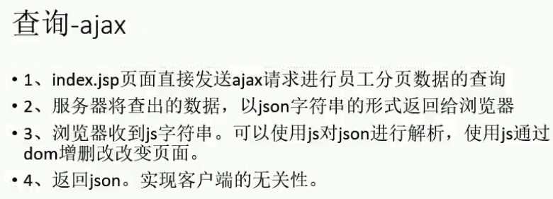

pom.xml

注解@ResponseBody返回的是json数据，而它要起作用，就需要Jackson包的支持！

```xml
<!-- 返回Jackson字符串的支持 -->
<dependency>
    <groupId>com.fasterxml.jackson.core</groupId>
    <artifactId>jackson-databind</artifactId>
    <version>2.8.8</version>
</dependency>
```

原始的

```java
// 以json格式返回数据（前面那个是对象），json传输适用于各平台
// @ResponseBody要能正常工作，需要导入Jackson包
@RequestMapping("/emps")
@ResponseBody
public PageInfo getEmpsWithJson(@RequestParam(value = "pn",defaultValue = "1") Integer pn){
    PageHelper.startPage(pn,5);
    List<Employee> emps = employeeService.getAll();
    PageInfo page = new PageInfo(emps,5);
    return page;
}
```

增强的

```java
// 增强原始要返回的数据，返回自定义的Msg对象，这样返回的json数据更加通用！
@RequestMapping("/emps")
@ResponseBody
public Msg getEmpsWithJson(@RequestParam(value = "pn",defaultValue = "1") Integer pn){
    PageHelper.startPage(pn,5);
    List<Employee> emps = employeeService.getAll();
    PageInfo page = new PageInfo(emps,5);
    return Msg.success().add("pageInfo",page);
}
```

自定义的类型

```java
/**
 * 通用的返回类
 *   封装了要返回给用户的数据，同时还扩充了一些内容！最终需要解析的就是这个新的返回的msg对象类型！
 *   装饰者模式！？还是包装类而已？！总之增强了原始数据！让其多了code、msg！
 */
public class Msg {
    // 状态码：100-成功，200-失败
    private int code;
    // 提示信息
    private String msg;
    // 用户要返回给浏览器的数据
    private Map<String,Object> extend = new HashMap<>();

    // 成功
    public static Msg success(){
        Msg result = new Msg();
        result.setCode(100);
        result.setMsg("处理成功！");
        return result;
    }

    // 失败
    public static Msg fail(){
        Msg result = new Msg();
        result.setCode(200);
        result.setMsg("处理失败！");
        return result;
    }

    // 处理用户自定义的key与value
    public Msg add(String key, Object value) {
        this.getExtend().put(key,value);
        return this;
    }
    
    // getter、setter方法自己补充
}
```


### 6、构建员工列表

```jsp
<table id="emps_table">
    <thead>
    </thead>
    <tbody>
    </tbody>
</table>


<script type="text/javascript">
    // 1、页面加载完成后，直接去发送一个ajax请求获取分页数据！
    $(function () {
        $.ajax({
            url:"${APP_PATH}/emps",
            data:"pn=1",
            type:"GET",
            success:function (result) {
                //console.log(result);
                // 1、解析并显示员工数据
                build_emps_table(result);
                // 2、解析并显示分页信息
            }
        });
    });

    function build_emps_table(result) {
        var emps = result.extend.pageInfo.list;
        $.each(emps,function (index,item) {
            //alert(item.empName);
            var empIdTd = $("<td></td>").append(item.empId);
            var empNameTd = $("<td></td>").append(item.empName);
            var genderTd = $("<td></td>").append(item.gender=='M'?"男":"女");
            var emailTd = $("<td></td>").append(item.email);
            var deptNameTd = $("<td></td>").append(item.department.deptName);

            var editBtn = $("<button></button>").addClass("btn btn-primary btn-sm")
                .append($("<span></span>").addClass("glyphicon glyphicon-pencil"))
                .append("编辑");
            var delBtn = $("<button></button>").addClass("btn btn-danger btn-sm")
                .append($("<span></span>").addClass("glyphicon glyphicon-trash"))
                .append("删除");
            // 这两按钮放到同一个单元格中，两个按钮间再加个空格
            var btnTd = $("<td></td>").append(editBtn).append(" ").append(delBtn);

            // append方法执行完成后还是返回原来的元素tr，所以可以这样拼接
            $("<tr></tr>").append(empIdTd)
                .append(empNameTd)
                .append(genderTd)
                .append(emailTd)
                .append(deptNameTd)
                .append(btnTd)
                .appendTo("#emps_table tbody");
        });
    }

    function build_page_nav(result) {

    }

</script>
```


### 7、构建分页条

```jsp
<%-- 分页信息 --%>
<div class="row">
    <%-- 分页文件信息 --%>
    <div class="col-md-6" id="page_info_area"></div>
    <%-- 分页条信息 --%>
    <div class="col-md-6" id="page_nav_area"></div>
</div>


<script type="text/javascript">

    // 解析分页信息
    function build_page_info(result){
        $("#page_info_area").append("当前是第"+result.extend.pageInfo.pageNum+"页，共"+result.extend.pageInfo.pages+"页，总共"+result.extend.pageInfo.total+"条记录。");
    }

    // 解析分页条，点击分页能跳转到下一页
    function build_page_nav(result) {
        var ul = $("<ul></ul>").addClass("pagination");
        // 首页
        var firstPageLi = $("<li></li>").append($("<a></a>").append("首页").attr("href","#"));
        // 前一页
        var prePageLi = $("<li></li>").append($("<a></a>").append("&laquo;"));
        // 下一页
        var nextPageLi = $("<li></li>").append($("<a></a>").append("&raquo;"));
        // 末页
        var lastPageLi = $("<li></li>").append($("<a></a>").append("末页").attr("href","#"));
        // 添加首页、前一页的提示
        ul.append(firstPageLi).append(prePageLi);
        // 遍历连续的分页
        $.each(result.extend.pageInfo.navigatepageNums,function (index,item) {
            var numLi = $("<li></li>").append($("<a></a>").append(item));
            // 遍历给ul中添加页码提示
            ul.append(numLi);
        });
        // 添加下一页、末页的提示
        ul.append(nextPageLi).append(lastPageLi);
        // 把ul添加到nav中
        var navEle = $("<nav></nav>").append(ul);
        navEle.appendTo("#page_nav_area");
    }

</script>
```


### 8、分页显示完整细节

```jsp
<script type="text/javascript">
    $(function () {
        to_page(1);  // 去首页
    });

    function to_page(pn) {  //
        $.ajax({
            url:"${APP_PATH}/emps",
            data:"pn="+pn,  // 动态的
            type:"GET",
            success:function (result) {
                build_emps_table(result);
                build_page_info(result);
                build_page_nav(result);
            }
        });
    }

    function build_emps_table(result) {
        $("#emps_table tbody").empty();  // 构建之前，先清空（下面同理）
        var emps = result.extend.pageInfo.list;
        $.each(emps,function (index,item) {
            var empIdTd = $("<td></td>").append(item.empId);
            var empNameTd = $("<td></td>").append(item.empName);
            var genderTd = $("<td></td>").append(item.gender=='M'?"男":"女");
            var emailTd = $("<td></td>").append(item.email);
            var deptNameTd = $("<td></td>").append(item.department.deptName);
            var editBtn = $("<button></button>").addClass("btn btn-primary btn-sm")
                .append($("<span></span>").addClass("glyphicon glyphicon-pencil"))
                .append("编辑");
            var delBtn = $("<button></button>").addClass("btn btn-danger btn-sm")
                .append($("<span></span>").addClass("glyphicon glyphicon-trash"))
                .append("删除");
            var btnTd = $("<td></td>").append(editBtn).append(" ").append(delBtn);
            $("<tr></tr>").append(empIdTd)
                .append(empNameTd)
                .append(genderTd)
                .append(emailTd)
                .append(deptNameTd)
                .append(btnTd)
                .appendTo("#emps_table tbody");
        });
    }

    function build_page_info(result){
        $("#page_info_area").empty();  //
        $("#page_info_area").append("当前是第"+result.extend.pageInfo.pageNum+"页，共"+result.extend.pageInfo.pages+"页，总共"+result.extend.pageInfo.total+"条记录。");
    }

    function build_page_nav(result) {
        $("#page_nav_area").empty();  //
        var ul = $("<ul></ul>").addClass("pagination");
        var firstPageLi = $("<li></li>").append($("<a></a>").append("首页").attr("href","#"));
        var prePageLi = $("<li></li>").append($("<a></a>").append("&laquo;"));
        if(result.extend.pageInfo.hasPreviousPage == false){  // 判断显示样式，绑定事件
            firstPageLi.addClass("disabled");
            prePageLi.addClass("hidden");
        } else {
            firstPageLi.click(function () {  // 为元素添加点击翻页事件
                to_page(1);
            });
            prePageLi.click(function () {
                to_page(result.extend.pageInfo.pageNum-1);
            });
        }
        var nextPageLi = $("<li></li>").append($("<a></a>").append("&raquo;"));
        var lastPageLi = $("<li></li>").append($("<a></a>").append("末页").attr("href","#"));
        if(result.extend.pageInfo.hasNextPage == false){  //
            nextPageLi.addClass("hidden");
            lastPageLi.addClass("disabled");
        } else {
            nextPageLi.click(function () {
                to_page(result.extend.pageInfo.pageNum+1);
            });
            lastPageLi.click(function () {
                to_page(result.extend.pageInfo.pages);
            });
        }
        ul.append(firstPageLi).append(prePageLi);
        $.each(result.extend.pageInfo.navigatepageNums,function (index,item) {
            var numLi = $("<li></li>").append($("<a></a>").append(item));
            if(result.extend.pageInfo.pageNum == item){  //
                numLi.addClass("active");
            }
            numLi.click(function () {  //
                to_page(item);
            });
            ul.append(numLi);
        });
        ul.append(nextPageLi).append(lastPageLi);
        var navEle = $("<nav></nav>").append(ul);
        navEle.appendTo("#page_nav_area");
    }
</script>
```

mybaits-config.xml

reasonable参数，在前一页、后一页点击事件中，到达“最值”时，只会查到第一页、最后一页！不会出现到达第一页时点击跳转的第0页甚至负数页的情况，最后一页同理！

```xml
<!-- 分页插件 -->
<plugins>
    <plugin interceptor="com.github.pagehelper.PageInterceptor">
        <!-- 分页参数合理化 -->
        <property name="reasonable" value="true"/>
    </plugin>
</plugins>
```


## 四、新增

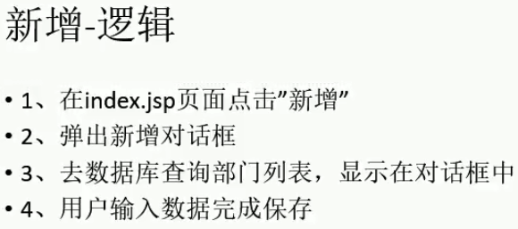

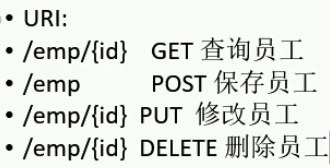

### 1、创建员工新增的模态框

[参考](https://v3.bootcss.com/css/#forms)

```jsp
<!-- 员工添加的模态框 -->
<div class="modal fade" id="empAddModal" tabindex="-1" role="dialog" aria-labelledby="exampleModalLabel" aria-hidden="true">
    <div class="modal-dialog">
        <div class="modal-content">
            <div class="modal-header">
                <h5 class="modal-title" id="exampleModalLabel">员工添加</h5>
                <button type="button" class="close" data-dismiss="modal" aria-label="Close">
                    <span aria-hidden="true">&times;</span>
                </button>
            </div>
            <div class="modal-body">
                <form class="form-horizontal">
                    <div class="form-group">
                        <label class="col-sm-2 control-label">empName</label>
                        <div class="col-sm-10">
                            <input type="text" name="empName" class="form-control" id="empName_add_input" placeholder="empName">
                        </div>
                    </div>
                    <div class="form-group">
                        <label class="col-sm-2 control-label">email</label>
                        <div class="col-sm-10">
                            <input type="text" name="email" class="form-control" id="email_add_input" placeholder="email@myself.com">
                        </div>
                    </div>
                    <div class="form-group">
                        <label class="col-sm-2 control-label">gender</label>
                        <div class="col-sm-10">
                            <label class="radio-inline">
                                <input type="radio" name="gender" id="gender_add_input" value="M" checked="checked"> 男
                            </label>
                            <label class="radio-inline">
                                <input type="radio" name="gender" id="gender2_add_input" value="F"> 女
                            </label>
                        </div>
                    </div>
                    <div class="form-group">
                        <label class="col-sm-2 control-label">deptName</label>
                        <div class="col-sm-4">
                            <%-- 提交部门id即可 --%>
                            <select class="form-control" name="dId">
                            </select>
                        </div>
                    </div>
                </form>
            </div>
            <div class="modal-footer">
                <button type="button" class="btn btn-secondary" data-dismiss="modal">关闭</button>
                <button type="button" class="btn btn-primary">保存</button>
            </div>
        </div>
    </div>
</div>


<%-- 按钮 --%>
<div class="row">
    <div class="col-md-4 col-md-offset-8">
        <button class="btn btn-primary" id="emp_add_modal_btn">新增</button>
        <button class="btn btn-danger">删除</button>
    </div>
</div>

<script>
    // 点击新增按钮，弹出模态框
    $("#emp_add_modal_btn").click(function () {
        // 弹出模态框
        $("#empAddModal").modal({
            backdrop:"static"
        });
    });
</script>
```


### 2、AJAX新增部门信息

```jsp
<!-- 员工添加的模态框 -->
<div class="modal fade" id="empAddModal" ...>
    ...
    <%-- 提交部门id即可 --%>
    <select class="form-control" name="dId" id="dept_add_select">
    </select>
    ...
</div>

<script>
    // 查询所有部门信息并显示在下拉列表中
    function getDepts() {
        $.ajax({
            url:"${APP_PATH}/depts",
            type:"GET",
            success:function (result) {
                console.log(result);
                // 显示部门信息在下拉列表中
                $.each(result.extend.depts,function () {
                    var optionEle = $("<option></option>").append(this.deptName).attr("value",this.deptId);
                    optionEle.appendTo("#empAddModal select");  // 利用jQuery选择器找到该元素并添加上
                });
            }
        });
    }
</script>
```

controller

```java
@Controller
public class DepartmentController {

    @Autowired
    private DepartmentService departmentService;

    /**
     * 返回所有的部门信息
     */
    @RequestMapping("/depts")
    @ResponseBody
    public Msg getDepts(){
        List<Department> list = departmentService.getDepts();
        return Msg.success().add("depts",list);
    }
}
```

service

```java
@Service
public class DepartmentService {

    @Autowired
    private DepartmentMapper departmentMapper;

    public List<Department> getDepts() {
        List<Department> list = departmentMapper.selectByExample(null);
        return list;
    }
}
```


### 3、新增基本完成

```jsp
<div class="modal-footer">
    <button type="button" class="btn btn-primary" id="emp_save_btn">保存</button>
</div>

<script>
    // 全局的总记录数
    var totalRecord;
    
    // 解析分页信息
    function build_page_info(result){
       ...
        totalRecord = result.extend.pageInfo.total;
    }
    
$("#emp_save_btn").click(function () {
        // 1、模态框中填写的表单数据提交给服务器进行保存
        // 2、发送ajax请求，保存员工
        //alert($("#empAddModal form").serialize());  // 这就是向服务器发送的要保存的数据，都是从form中获取的值
        $.ajax({
            url:"${APP_PATH}/emp",
            type:"POST",
            data:$("#empAddModal form").serialize(),
            success:function (result) {
                //alert(result.msg);
                // 员工保存成功后，需要如下后续操作
                // 1、关闭模态框
                $("#empAddModal").modal('hide');
                // 2、来到最后一页，显示刚才保存的数据
                // 发送ajax请求，显示最后一页数据即可（可以传入总记录数【该数一般都会比最后一页页码大】作为最后一页页码，就算大于最后页码，分页插件会将其优化查到最后一页的）
                to_page(totalRecord);
            }
        });
    });
</script>
```

controller

```java
    /**
     * 员工保存
     */
    @RequestMapping(value = "/emp",method = RequestMethod.POST)
    @ResponseBody
    public Msg saveEmp(Employee employee){
        employeeService.saveEmp(employee);
        return Msg.success();
    }
```

service

```java
    /**
     * 保存员工
     * @param employee
     */
    public void saveEmp(Employee employee) {
        employeeMapper.insertSelective(employee);
    }
```


### 4、jQuery前端校验

```
关于校验：
	前端：用户输入的数据格式是否合法，例如邮箱格式！
	后端：数据库中是否已存在相同的元素，例如相同的姓名！
较为完整的校验应该是:
	1、jQuery前端校验
	2、ajax用户名重复校验
	3、重要数据，后端校验（可以使用spring支持的JSR303校验，唯一约束）
其实，用户名的重复（唯一约束），除了使用前后端校验外，直接在设计数据库表时唯一约束也行！

	前端校验“只能防君子，不能防小人”，也就是可以有点前端知识的话，可以绕过前端校验的，
	例如浏览器禁用js脚本、或者修改传入的参数等使之可以校验成功，
	而后端校验是不会被绕过的，所以建议：重要的数据，一定要经过后端校验！
```

数据保存之前要校验

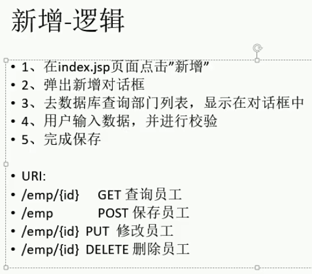

正则表达式

百度jQuery文档吧，在线的很多！

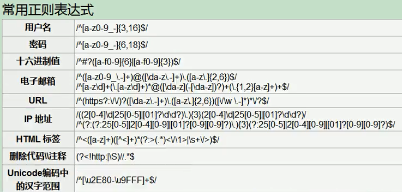

```jsp
<script>
    // 校验表单数据
    function validate_add_form(){
        // 使用正则表达式校验
        // 校验姓名
        var empName = $("#empName_add_input").val();
        var regName = /(^[a-zA-Z0-9_-]{6,16}$)|(^[\u2E80-\u9FFF]{2,5})/;
        //alert(regName.test(empName));
        if (!regName.test(empName)){
            alert("用户名可以是2-5位中文或6-16位英文和数字的组合！");
            return false;
        }
        // 校验邮箱
        var email = $("#email_add_input").val();
        var regEmail = /^([a-z0-9_\.-]+)@([\da-z\.-]+)\.([a-z\.]{2,6})$/;
        if (!regEmail.test(email)){
            alert("邮箱格式不正确！");
            return false;
        }
        return true;
    }

    // 点击保存员工
    $("#emp_save_btn").click(function () {
        // 1、保存之前要先校验数据
        if (!validate_add_form()){
            return false;
        }
        // 2、发送ajax请求，保存员工
        $.ajax({
            ...
        });
    });
</script>
```


### 5、校验信息显示优化

```jsp
<div class="form-group">
    <label>empName</label>
    <div>
        <input name="empName" id="empName_add_input">
        <span class="help-block"></span>  <!--显示校验结果的-->
    </div>
</div>
<div class="form-group">
    <label>email</label>
    <div>
        <input name="email" id="email_add_input">
        <span class="help-block"></span>
    </div>
</div>

<script>
// 显示校验结果信息
    function show_validate_msg(ele,status,msg) {
        // 校验之前，要先清空这个元素原有的校验状态
        $(ele).parent().removeClass("has-success has-error");
        $(ele).next("span").text(msg);

        if ("success"==status){
            $(ele).parent().addClass("has-success");
            $(ele).next("span").text(msg);
        } else if ("error"==status){
            $(ele).parent().addClass("has-error");
            $(ele).next("span").text(msg);
        }
    }

    // 校验表单数据
    function validate_add_form(){
        // 校验姓名
        var empName = $("#empName_add_input").val();
        var regName = /(^[a-zA-Z0-9_-]{6,16}$)|(^[\u2E80-\u9FFF]{2,5})/;
        //alert(regName.test(empName));
        if (!regName.test(empName)){
            show_validate_msg("#empName_add_input","error","用户名可以是2-5位中文或6-16位英文和数字的组合！");
            return false;
        } else {
            show_validate_msg("#empName_add_input","success","");
        }
        // 校验邮箱
        var email = $("#email_add_input").val();
        var regEmail = /^([a-z0-9_\.-]+)@([\da-z\.-]+)\.([a-z\.]{2,6})$/;
        if (!regEmail.test(email)){
            show_validate_msg("#email_add_input","error","邮箱格式不正确！");
            return false;
        } else {
            show_validate_msg("#email_add_input","success","");
        }
        return true;
    }
</script>
```


### 6、AJAX校验用户名是否重复

controller

```java
    /**
     * 校验用户名是否可用
     */
    @ResponseBody
    @RequestMapping("/checkuser")
    public Msg checkUser(@RequestParam("empName") String empName){
        boolean b = employeeService.checkUser(empName);
        if (b){
            return Msg.success();
        } else {
            return Msg.fail();
        }
    }
```

service

```java
    /**
     * 检验用户名是否可用
     * @param empName
     * @return true-可用，false-不可用
     */
    public boolean checkUser(String empName) {
        EmployeeExample example = new EmployeeExample();
        EmployeeExample.Criteria criteria = example.createCriteria();
        criteria.andEmpNameEqualTo(empName);
        long count = employeeMapper.countByExample(example);
        return count == 0;
    }
```

index.jsp

```jsp
<script>
    // 点击新增按钮，弹出模态框
    $("#emp_add_modal_btn").click(function () {
        // 每次弹出之前都要清空表单数据（即：表单重置），否则可能会越过验证步骤
        $("#empAddModal form")[0].reset();
        ...
    });
    
    // 校验用户名是否可用
    $("#empName_add_input").change(function () {
        // 发送ajax请求校验用户名是否可用（主要是重复问题）
        var  empName = this.value;
        $.ajax({
            url:"${APP_PATH}/checkuser",
            type:"POST",
            data:"empName="+empName,
            success:function (result) {
                if (result.code == 100){
                    show_validate_msg("#empName_add_input","success","用户名可用");
                    $("#emp_save_btn").attr("ajax-va","success");
                } else {
                    show_validate_msg("#empName_add_input","error","用户名不可用");
                    $("#emp_save_btn").attr("ajax-va","error");
                }
            }
        });
    });

    // 点击保存员工
    $("#emp_save_btn").click(function () {
        // 1、保存之前要先校验数据
        ...
        // 2、判断之前的ajax用户名校验是否成功，成功才会继续往下执行
        if($(this).attr("ajax_va") == "error"){
            return false;
        }
        // 3、发送ajax请求，保存员工
        ...
</script>
```


### 7、AJAX校验用户名细节处理

前后端统一校验，前面还存在一个问题：后端成功了，但前端又失败了！（例如：后端“aaa”不重名可用了，验证通过；前端，却又不满足6-16位字母或数字，验证失败）

1、统一验证信息

```java
    /**
     * 校验用户名是否可用
     */
    @ResponseBody
    @RequestMapping("/checkuser")
    public Msg checkUser(@RequestParam("empName") String empName){
        // 先判断用户名是否是合法的表达式
        String regx = "(^[a-zA-Z0-9_-]{6,16}$)|(^[\\u2E80-\\u9FFF]{2,5})";
        if (!empName.matches(regx)){
            return Msg.fail().add("va_msg","用户名必须是6-16位英文和数字的组合或2-5位的中文！");  // msg
        }
        boolean b = employeeService.checkUser(empName);
        if (b){
            return Msg.success();
        } else {
            return Msg.fail().add("va_msg","用户名不可用");
        }
    }
```

```jsp
<script>
    $("#empName_add_input").change(function () {
        var  empName = this.value;
        $.ajax({
            url:"${APP_PATH}/checkuser",
            type:"POST",
            data:"empName="+empName,
            success:function (result) {
                if (result.code == 100){
                    show_validate_msg("#empName_add_input","success","用户名可用");
                    $("#emp_save_btn").attr("ajax-va","success");
                } else {
                    show_validate_msg("#empName_add_input","error",result.extend.va_msg);  // 使用后端的msg
                    $("#emp_save_btn").attr("ajax-va","error");
                }
            }
        });
    });
</script>
```

2、完整重置表单

```jsp
<script>
    // 完整重置表单信息：清空样式及内容
    function reset_form(ele){
        $(ele)[0].reset();
	    $(ele).find("*").removeClass("has-error has-success");  // 清空样式
        $(ele).find(".help-block").text("");
    }
    
    // 点击新增按钮，弹出模态框
    $("#emp_add_modal_btn").click(function () {
        // 每次弹出之前都要清空表单数据（即：表单重置），否则可能会越过验证步骤
        //$("#empAddModal form")[0].reset();  // 仅仅是文本值被重置而已，应该让表单完整重置：数据、样式都要重置
        reset_form("#empAddModal form");
        getDepts();
        $("#empAddModal").modal({
            backdrop:"static"
        });
    });
</script>
```


### 8、JSR303校验

pom.xml

```xml
<!-- JSR303数据校验支持 -->
<!--
  jsr303需要Tomcat7及其以上的服务器支持，
  但如果使用Tomcat7以下的服务器的话也行，只是需要额外给服务器的lib包中替换新的标准的el，
  因为旧版的el不是新的标准，其功能不强大。
-->
<dependency>
    <groupId>org.hibernate</groupId>
    <artifactId>hibernate-validator</artifactId>
    <version>6.0.17.Final</version>
</dependency>
```

导入依赖后，使用注解在Javabean属性上，具体给哪个属性校验就加在哪个上！

bean

```java
public class Employee {
    // java中斜杠【\】具有特殊含义，需要使用双斜杠【\\】将其转义为普通符号
    @Pattern(regexp = "(^[a-zA-Z0-9_-]{6,16}$)|(^[\\u2E80-\\u9FFF]{2,5})",
            message = "用户名可以是2-5位中文或6-16位英文和数字的组合！")
    private String empName;

    //@Email  // 可以直接使用这个注解，也可以使用如下自定义的规则
    @Pattern(regexp = "^([a-z0-9_\\.-]+)@([\\da-z\\.-]+)\\.([a-z\\.]{2,6})$",
            message = "邮箱格式不正确")
    private String email;
    ...
}
```

注解@Valid，代表数据封装为对象后，对象中的数据需要校验；校验成功、失败的结果，封装在其后紧跟的对象BindingResult中

controller

```java
    @RequestMapping(value = "/emp",method = RequestMethod.POST)
    @ResponseBody
    public Msg saveEmp(@Valid Employee employee, BindingResult result){
        if (result.hasErrors()){
            // 校验失败，应该返回失败信息，在模态框中显示失败的错误信息
            Map<String,Object> map = new HashMap<>();
            List<FieldError> errors = result.getFieldErrors();
            for (FieldError error : errors) {
                //System.out.println("错误的字段名：" + error.getField());
                //System.out.println("错误信息：" + error.getDefaultMessage());
                map.put(error.getField(),error.getDefaultMessage());
            }
            return Msg.fail().add("errorFields",map);
        } else {
            employeeService.saveEmp(employee);
            return Msg.success();
        }
    }
```

index.jsp

```jsp
<script>
    // 点击保存员工
    $("#emp_save_btn").click(function () {
        // 1、保存之前要先校验数据(这是前端校验)
        if (!validate_add_form()){
            return false;
        }
        // 2、判断之前的ajax用户名校验是否成功，成功才会继续往下执行
        if($(this).attr("ajax_va") == "error"){
            return false;
        }
        // 3、发送ajax请求，保存员工
        $.ajax({
            url:"${APP_PATH}/emp",
            type:"POST",
            data:$("#empAddModal form").serialize(),
            success:function (result) {
                if (result.code == 100){  // 校验成功
                    $("#empAddModal").modal('hide');
                    to_page(totalRecord);
                } else {  // 校验失败
                    // 显示失败信息
                    // 有哪个字段的错误信息就显示哪个字段的（没错误的就是undefined）
                    //console.log(result);
                    //alert(result.extend.errorFields.email);
                    //alert(result.extend.errorFields.empName);
                    if (undefined != result.extend.errorFields.email){
                        // 显示邮箱错误信息
                        show_validate_msg("#email_add_input","error",result.extend.errorFields.email);
                    }
                    if (undefined != result.extend.errorFields.empName){
                        // 显示员工名错误信息
                        show_validate_msg("#empName_add_input","error",result.extend.errorFields.empName);
                    }
                }
            }
        });
    });
</script>
```


## 五、修改

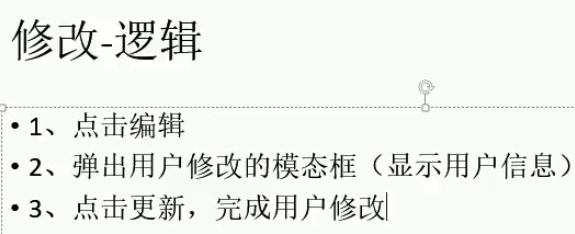

### 1、创建员工修改模态框

使用原有的“添加”的模态框来创建！复制过来并改动一下即可！

```jsp
<!-- 员工修改的模态框 -->
<div class="modal fade" id="empUpdateModal" tabindex="-1" role="dialog" aria-labelledby="exampleModalLabel" aria-hidden="true">
    <div class="modal-dialog">
        <div class="modal-content">
            <div class="modal-header">
                <h5 class="modal-title">员工修改</h5>  <!-- 改 -->
                <button type="button" class="close" data-dismiss="modal" aria-label="Close">
                    <span aria-hidden="true">&times;</span>
                </button>
            </div>
            <div class="modal-body">
                <form class="form-horizontal">
                    <div class="form-group">
                        <label class="col-sm-2 control-label">empName</label>
                        <div class="col-sm-10">
                            <input type="text" name="empName" class="form-control" id="empName_update_input" placeholder="empName">  <!-- 改 -->
                            <span class="help-block"></span>
                        </div>
                    </div>
                    <div class="form-group">
                        <label class="col-sm-2 control-label">email</label>
                        <div class="col-sm-10">
                            <input type="text" name="email" class="form-control" id="email_update_input" placeholder="email@myself.com"> <!-- 改 -->
                            <span class="help-block"></span>
                        </div>
                    </div>
                    <div class="form-group">
                        <label class="col-sm-2 control-label">gender</label>
                        <div class="col-sm-10">
                            <label class="radio-inline">
                                <!-- 改 -->
                                <input type="radio" name="gender" id="gender_update_input" value="M" checked="checked"> 男
                            </label>
                            <label class="radio-inline">
                                <!-- 改 -->
                                <input type="radio" name="gender" id="gender2_update_input" value="F"> 女
                            </label>
                        </div>
                    </div>
                    <div class="form-group">
                        <label class="col-sm-2 control-label">deptName</label>
                        <div class="col-sm-4">
                            <%-- 提交部门id即可 --%>
                            <select class="form-control" name="dId" id="dept_add_select">
                            </select>
                        </div>
                    </div>
                </form>
            </div>
            <div class="modal-footer">
                <!-- 改 -->
                <button type="button" class="btn btn-secondary" data-dismiss="modal">关闭</button>
                <button type="button" class="btn btn-primary" id="emp_update_btn">更新</button>
            </div>
        </div>
    </div>
</div>

<script>
    // 解析员工数据时，“编辑按钮”记得加上：edit_btn
    // addClass("btn btn-primary btn-sm edit_btn")
    
    // 查询所有部门信息并显示在下拉列表中
    function getDepts(ele) {
        // 清空之前下拉列表的值
        $(ele).empty();
        ...
    }
        
    /*
        以下是绑定不上按钮单击事件的，
        因为发送ajax请求后才创建出来，而以下是页面加载时绑定的操作，
        也就是说：按钮还没创建出来，你却给它绑定上？按钮都还没有呢！！！
            $(".edit_btn").click(function () {
                alert("edit");
            });
     */
    // 解决：
    // 1）创建按钮时绑定（耦合度高，不推荐）
    // 2）绑定点击.live()，即使是后来创建出来的元素，也可以绑定上
    /*
        $(".edit_btn").live(function () {  // 新新版jQuery中移除了live，使用on代替了
            alert("edit");
        });
     */
    $(document).on("click",".edit_btn",function () {
        //alert("edit");
        // 1、查询员工信息，并显示员工信息
        // 2、查询部门信息，并显示部门列表
        // 3、弹出模态框
        getDepts("#empUpdateModal select");
        $("#empUpdateModal").modal({
            backdrop:"static"
        });
    });
</script>
```


### 2、回显员工信息

```jsp
<div class="form-group">
    <label class="col-sm-2 control-label">empName</label>
    <div class="col-sm-10">
     <%--<input type="text" name="empName" class="form-control" id="empName_update_input" placeholder="empName">--%>
        <%-- 名称不应该修改，只需要显示出来，所以input改为p --%>
        <p class="form-control-static" id="emp_update_static"></p>
        <span class="help-block"></span>
    </div>
</div>

<script>
	// 解析员工数据
    function build_emps_table(result) {
        $("#emps_table tbody").empty();
        var emps = result.extend.pageInfo.list;
        $.each(emps,function (index,item) {
            var empIdTd = $("<td></td>").append(item.empId);
            var editBtn = $("<button></button>").addClass("btn btn-primary btn-sm edit_btn")
                .append($("<span></span>").addClass("glyphicon glyphicon-pencil"))
                .append("编辑");
            ...
            // 为每个编辑按钮添加一个自定义的属性，表示当前员工的id（在编辑更新时会用到！）
            editBtn.attr("edit-id",item.empId);
            ...
        }
            
    $(document).on("click",".edit_btn",function () {
        //alert("edit");
        // 1、查询部门信息，并显示部门列表
        getDepts("#empUpdateModal select");
        // 2、查询员工信息，并显示员工信息
        getEmp($(this).attr("edit-id"));
        // 3、弹出模态框
        $("#empUpdateModal").modal({
            backdrop:"static"
        });
    });

    // 查询员工信息，并显示员工信息
    function getEmp(id) {
        $.ajax({
            url:"${APP_PATH}/emp/"+id,
            type:"GET",
            success:function (result) {
                //console.log(result);
                var empData = result.extend.emp;
                $("#empName_update_static").text(empData.empName);
                $("#email_update_input").val(empData.email);
                $("#empUpdateModal input[name=gender]").val([empData.gender]);
                $("#empUpdateModal select").val([empData.dId]);
            }
        });
    }
</script>
```

```java
    /**
     * 查询一个员工的信息，用来展示在修改页面的
     */
    @RequestMapping(value = "/emp/{id}",method = RequestMethod.GET)
    @ResponseBody
    public Msg getEmp(@PathVariable("id") Integer id){
        Employee employee = employeeService.getEmp(id);
        return Msg.success().add("emp",employee);
    }
```

```java
    /**
     * 根据员工id查询员工
     * @param id
     * @return
     */
    public Employee getEmp(Integer id) {
        Employee employee = employeeMapper.selectByPrimaryKey(id);
        return employee;
    }
```


### 3、AJAX发送PUT请求引发的血案

```xml
  <!-- 使用Rest风格的URI，可以将页面普通的post请求转为指定的delete、put请求 -->
  <filter>
    <filter-name>hiddenHttpMethodFilter</filter-name>
    <filter-class>org.springframework.web.filter.HiddenHttpMethodFilter</filter-class>
  </filter>
  <filter-mapping>
    <filter-name>hiddenHttpMethodFilter</filter-name>
    <url-pattern>/*</url-pattern>
  </filter-mapping>
```

```java
    /**
     * 员工更新方法
     */
    @ResponseBody
    @RequestMapping(value = "/emp/{empId}",method = RequestMethod.PUT)  // 路径传来的参数需要和employee对象的属性名一致：empId
    public Msg saveEmp(Employee employee){
        System.out.println(employee);
        employeeService.updateEmp(employee);
        return Msg.success();
    }
```

```jsp
<script>
	// 点击更新按钮，更新员工信息
    $("#emp_update_btn").click(function () {
        // 1、验证邮箱是否合法
        var email = $("#email_update_input").val();
        var regEmail = /^([a-z0-9_\.-]+)@([\da-z\.-]+)\.([a-z\.]{2,6})$/;
        if (!regEmail.test(email)){
            show_validate_msg("#email_update_input","error","邮箱格式不正确！");
            return false;
        } else {
            show_validate_msg("#email_update_input","success","");
        }
        // 2、发送ajax请求保存更新的员工数据
        $.ajax({
            url:"${APP_PATH}/emp/"+$(this).attr("edit-id"),
            type:"POST",  /* post */
            data:$("#empUpdateModal form").serialize()+"&_method=PUT",  /* 别忘了这个参数：_method */
            /* rest风格的过滤器会帮你处理好_method的 */
            success:function (result) {
                alert(result.msg);
            }
        });
    });
</script>
```

引发的血案

```
上面是通过rest风格的uri间接发送put请求：
	type:"POST",
    data:$("#empUpdateModal form").serialize()+"&_method=PUT",  // _method=put由rest处理
    
但我们想直接使用type:"PUT"，毕竟ajax支持PUT请求发送，
	type:"PUT",
    data:$("#empUpdateModal form").serialize(),  // 不写_method=put
可是，这会引起Tomcat不封装put请求中请求体的数据到map中的问题！也就导致pojo封装不了对象！（血案）
```

```jsp
<script>
    $.ajax({
        url:"${APP_PATH}/emp/"+$(this).attr("edit-id"),
        type:"PUT",  // ajax支持特殊的请求put、delete等
        data:$("#empUpdateModal form").serialize(),  // 不加_method
        success:function (result) {
            alert(result.msg);
        }
    });
</script>
```

```java
/*
    // 发送ajax请求保存更新的员工数据
    $.ajax({
        url:"${APP_PATH}/emp/"+$(this).attr("edit-id"),
                type:"PUT",  // put
                data:$("#empUpdateModal form").serialize(),
                success:function (result) {
            alert(result.msg);
        }
    });

    以上，ajax直接发put请求，只有路径中的empId会被封装到employee中，其它为null
        [empId=99,empName=null,gender=null,email=null,dId=null]
    浏览器中，观察到请求体有数据，但封装不进employee，会导致后端sql语句发生错误！
        update tbl_emp where emp_id=#{empId}
    明显，set都没有，造成语法错误

    原因是：Tomcat
        1、将请求体中的数据，封装到map中
        2、request.getParameter("empName"); 会从这个map中取出值
        3、springmvc封装pojo对象时，会把pojo中每一个值：request.getParameter("email");

    ajax发送put请求引发的问题：
        put请求，请求体中的数据，request.getParameter("empName");拿不到数据
        tomcat看到是put请求，是不会封装请求体中的数据为map的，只有post请求才会封装进map中！（参看Tomcat源码）
    */
@ResponseBody
@RequestMapping(value = "/emp/{empId}",method = RequestMethod.PUT)
public Msg saveEmp(Employee employee, HttpServletRequest request){  // 使用原生的request验证能否拿到请求体中的数据
    //System.out.println(employee);
    System.out.println(request.getParameter("email"));
    // 你会发现得到null，而请求体中却是有值的（发put请求，观察浏览器中的请求体），有值但拿不到而已!!!
    employeeService.updateEmp(employee);
    return Msg.success();
}
```


### 4、修改完成

针对上面引发的血案，springmvc提供了一套解决方案：HttpPutFormContentFilter，可以解决Tomcat不封装put等特殊请求中请求体的数据的问题

web.xml

```xml
  <!-- 
        我们要想直接使用put这些特殊请求，且请求体的数据也会封装，
        那么，我们需要配置HttpPutFormContentFilter过滤器，
        过滤器作用：
          将请求体中的数据解析包装成一个map，
          request也被重新包装，request.getParameter()被重写，如此，就会从自己封装的map中取出数据了！
 -->
 <!-- 
	类比rest过滤器：需要_method参数，间接将put请求转为post请求，这样Tomcat才封装数据；
	而这个过滤器可以让我们直接发送put请求，Tomcat也会封装数据！
 -->
  <filter>
    <filter-name>httpPutFormContentFilter</filter-name>
    <filter-class>org.springframework.web.filter.HttpPutFormContentFilter</filter-class>
  </filter>
  <filter-mapping>
    <filter-name>httpPutFormContentFilter</filter-name>
    <url-pattern>/*</url-pattern>
  </filter-mapping>
```

```jsp
<script>
	// 全局的总记录数，本页面
    var totalRecord,currentPage;
    
    // 解析显示分页信息
    function build_page_info(result){
        ...
        currentPage = result.extend.pageInfo.pageNum;
    }
    
    // 点击更新按钮，更新员工信息
    $("#emp_update_btn").click(function () {
        // 1、验证邮箱是否合法
        var email = $("#email_update_input").val();
        var regEmail = /^([a-z0-9_\.-]+)@([\da-z\.-]+)\.([a-z\.]{2,6})$/;
        if (!regEmail.test(email)){
            show_validate_msg("#email_update_input","error","邮箱格式不正确！");
            return false;
        } else {
            show_validate_msg("#email_update_input","success","");
        }
        // 2、发送ajax请求保存更新的员工数据
        $.ajax({
            url:"${APP_PATH}/emp/"+$(this).attr("edit-id"),
            type:"PUT",  // ajax支持特殊请求
            data:$("#empUpdateModal form").serialize(),
            success:function (result) {
                // 1、关闭对话框
                $("#empUpdateModal").modal("hide");
                // 2、回到本页面
                to_page(currentPage);
            }
        });
    });
</script>
```

排序问题

```java
    public List<Employee> getAll() {
        EmployeeExample example = new EmployeeExample();
        example.setOrderByClause("emp_id asc");
        return employeeMapper.selectByExampleWithDept(example);  // 查询所有员工，并且排序
        //return employeeMapper.selectByExampleWithDept(null);  // null是查询所有员工，不排序
    }
```


## 六、删除

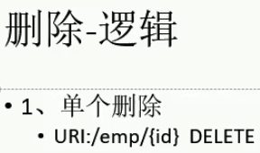

### 1、删除单一员工

```java
    /**
     * 根据id删除员工
     * @param id
     * @return
     */
    @ResponseBody
    @RequestMapping(value = "/emp/{id}",method = RequestMethod.DELETE)
    public Msg deleteEmpById(@PathVariable("id") Integer id){
        employeeService.deleteEmp(id);
        return Msg.success();
    }
```

```java
    /**
     * 员工删除
     * @param id
     */
    public void deleteEmp(Integer id) {
        employeeMapper.deleteByPrimaryKey(id);
    }
```

```jsp
// 加上delete_btn
var delBtn = $("<button></button>").addClass("btn btn-danger btn-sm delete_btn")

<script>
    // 解析员工数据
    function build_emps_table(result) {
        ...
        $.each(emps,function (index,item) {
            ...
            var delBtn = $("<button></button>").addClass("btn btn-danger btn-sm delete_btn")
                .append($("<span></span>").addClass("glyphicon glyphicon-trash"))
                .append("删除");
            // 为删除按钮添加一个自定义的属性，表示当前删除员工的id
            delBtn.attr("del-id",item.empId);
            ...
        }
            
    // 单个删除
    $(document).on("click",".delete_btn",function () {
        // 1、弹出是否确认删除对话框
        //alert($(this).parents("tr").find("td:eq(1)").text());
        var empName = $(this).parents("tr").find("td:eq(2)").text();  // 后面加了一个td，所以1-->2
        var empId = $(this).attr("del-id");
        if(confirm("确认删除【"+ empName +"】吗？")){
            // 确认，发送ajax请求删除
            $.ajax({
                url:"${APP_PATH}/emp/"+empId,
                type:"DELETE",
                success:function (result) {
                    alert(result.msg);
                    // 回到本页
                    to_page(currentPage);
                }
            });
        }
    });
</script>
```


### 2、全选、全不选

```jsp
<thead>
    <tr>
        <th>
            <input type="checkbox" id="check_all"/>
        </th>
        <th>#</th>
        ...
        <th>操作</th>
    </tr>
</thead>

<script>
    // 解析员工数据
    function build_emps_table(result) {
        ...
        $.each(emps,function (index,item) {
            var checkBoxTd = $("<td><input type='checkbox' class='check_item'/></td>");  //
            ...
            $("<tr></tr>").append(checkBoxTd)  // 
                .append(empIdTd)
                ...
                .append(btnTd)
                .appendTo("#emps_table tbody");
        });
    }
    
    // 完成全选、全不选功能
    $("#check_all").click(function () {
        /*
            attr获取checked是undefined
                dom原生的属性；attr获取自定义属性的值
            prop修改、读取dom原生属性的值
                true、false
         */
        //alert($(this).attr("checked"));
        //alert($(this).prop("checked"));
        $(".check_item").prop("checked",$(this).prop("checked"));
    });

    // check_item
    // 因为是后来的元素，所以需要document
    $(document).on("click",".check_item",function () {
        // 判断当前选中的元素是否5个
        var flag = $(".check_item:checked").length == $(".check_item").length;
        $("#check_all").prop("checked",flag);
    });
</script>
```


### 3、批量删除

```jsp
<%-- 按钮 --%>
<div>
    <div>
        ...
        <button class="btn btn-danger" id="emp_delete_all_btn">删除</button>
    </div>
</div>

<script>
	// 点击批量删除
    $("#emp_delete_all_btn").click(function () {
        var empNames = "";
        var del_idstr = "";
        $.each($(".check_item:checked"),function () {
            //alert($(this).parents("tr").find("td:eq(2)").text());
            empNames += $(this).parents("tr").find("td:eq(2)").text() + ",";
            // 组装员工id字符串
            del_idstr += $(this).parents("tr").find("td:eq(1)").text() + "-";
        });
        // 去除多余的逗号 ,
        empNames = empNames.substring(0,empNames.length-1);
        // 去除多余的id的横线 -
        del_idstr = del_idstr.substring(0,del_idstr.length-1);
        if (confirm("确认删除【"+ empNames +"】吗？")){
            // 发送ajax请求删除
            $.ajax({
                url:"${APP_PATH}/emp/"+del_idstr,
                type:"DELETE",
                success:function (result) {
                    alert(result.msg);
                    // 回到当前页面
                    to_page(currentPage);
                }
            });
        }
    });
</script>
```

```java
/**
     * 单个、批量二合一
     *  单个：1
     *  多个：1-2-3
     */
    @ResponseBody
    @RequestMapping(value = "/emp/{ids}",method = RequestMethod.DELETE)
    public Msg deleteEmpById(@PathVariable("ids") String ids){
        // 批量删除
        if (ids.contains("-")){
            List<Integer> del_ids = new ArrayList<>();
            String[] str_ids = ids.split("-");
            // 组装id的集合
            for (String str_id : str_ids) {
                del_ids.add(Integer.parseInt(str_id));
            }
            employeeService.deleteBatch(del_ids);
        } else {  // 单个删除
            Integer id = Integer.parseInt(ids);
            employeeService.deleteEmp(id);
        }
        return Msg.success();
    }
```

```java
    /**
     * 删除员工
     * @param ids
     */
    public void deleteBatch(List<Integer> ids) {
        EmployeeExample example = new EmployeeExample();
        EmployeeExample.Criteria criteria = example.createCriteria();
        // delete from xxx where emp_id in(1,2,3)
        criteria.andEmpIdIn(ids);
        employeeMapper.deleteByExample(example);
    }
```

小问题：全选的状态需要重置、判断，自己优化吧！


## 七、总结

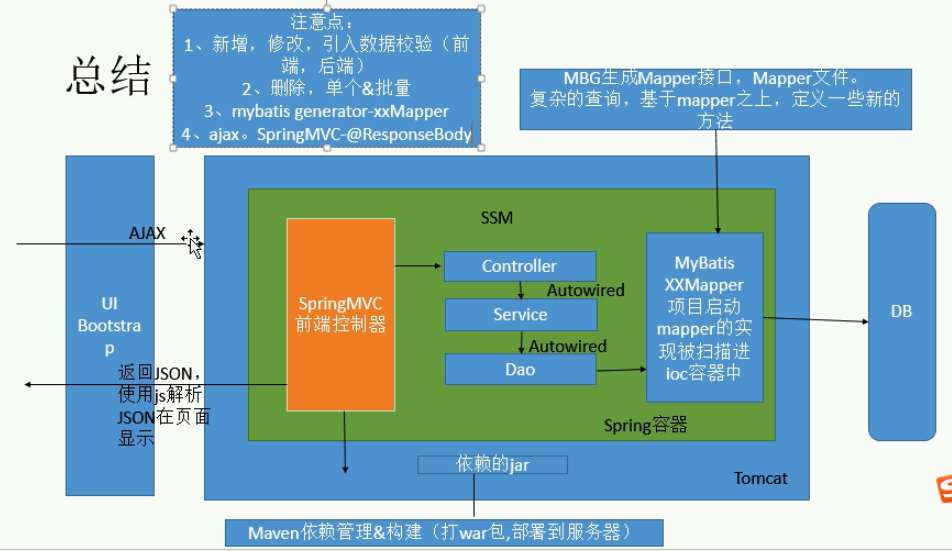

```xml
<!-- 将springmvc不能处理的请求交给Tomcat -->
    <mvc:default-servlet-handler/>  //  图中橙色部分，向下箭头
```

部署项目（必备：一个war包、一个Tomcat服务器）

```
部署：
	maven打包成war包后，放到Tomcat服务器中，即在【xxx/tomcat/webapps/】目录下
开启服务：
	切换到Tomcat的bin/目录下，cmd命令窗口，输入【startup.bat】启动服务器，  // shutdown.bat关闭服务
访问：
	在浏览器中输入【http://localhost:8080/war包名/】访问
```

